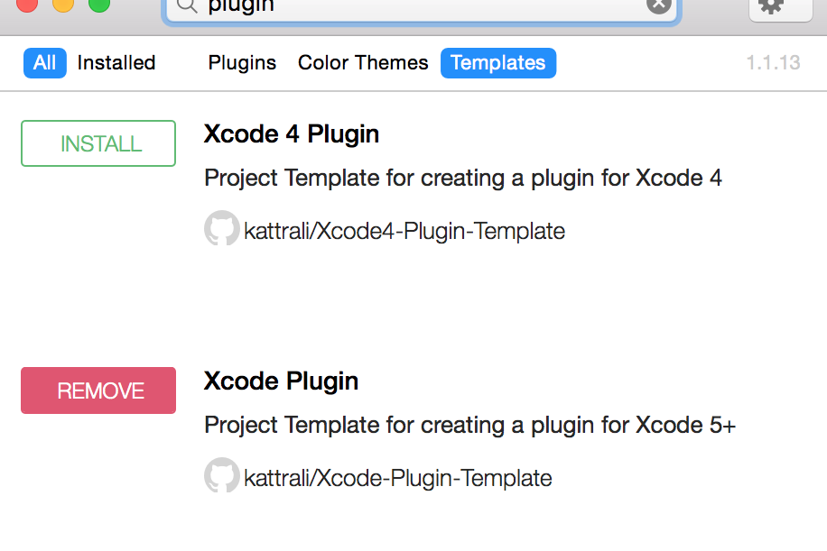
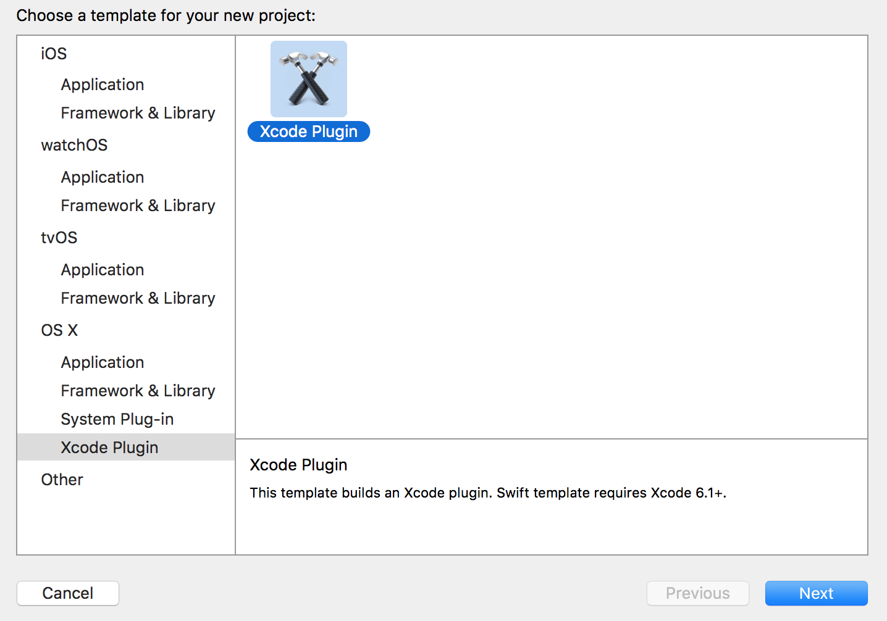

#### Prerequisites
* Install [Alcatraz](https://github.com/alcatraz/Alcatraz)
* Install Xcode Plugin (You can install the templat without Alcatraz. Alcatraz just makes it easier.)

* Create a new Xcode project selecting OS X => Xcode Plugin as template
